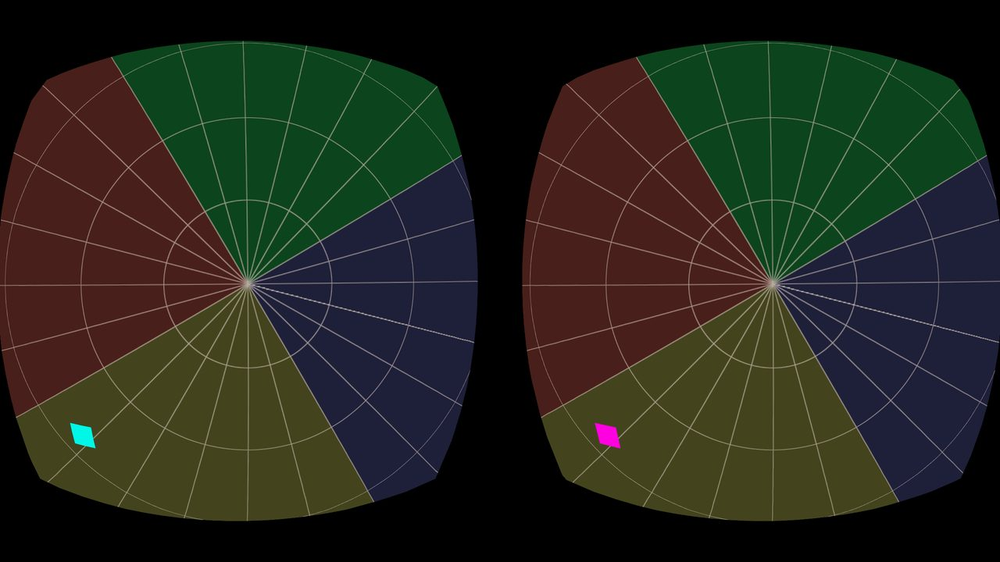
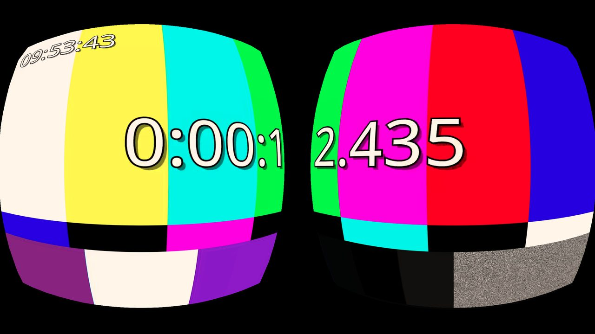
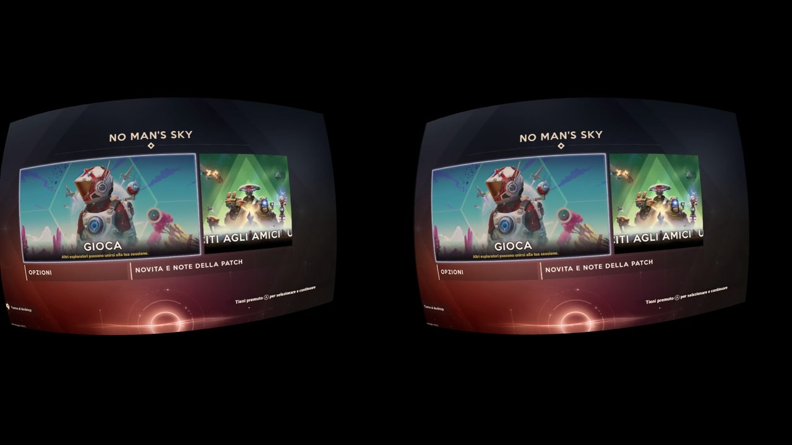
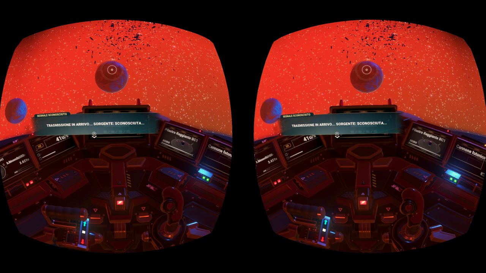
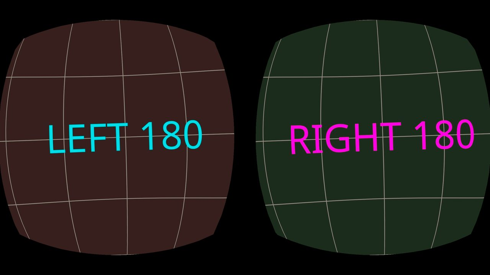
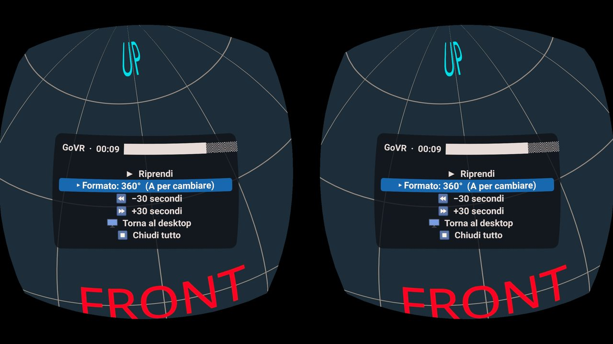
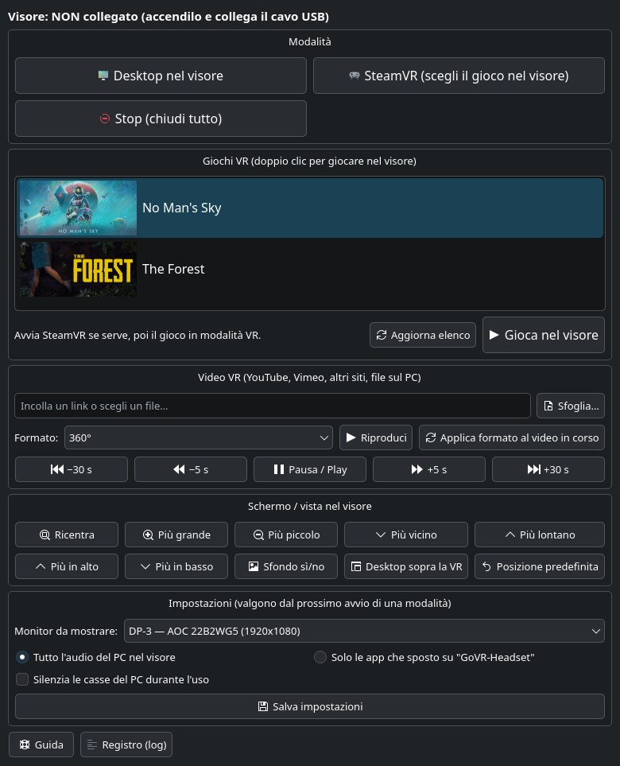

# GoVR — the Oculus Go as a wired PC-VR headset on Linux

GoVR turns an unlocked Oculus Go (MH-A32, Android 7.1) into a **USB-tethered headset for a Linux
PC**, while keeping the Go's own VR compositor, timewarp and sensor stack. The PC does the heavy
work (rendering, NVENC encoding); the Go decodes, reprojects with its native timewarp and plays
the audio.

Tested on: Oculus Go 32 GB (`pacific`, official unlocked build) + CachyOS (Arch), KDE Plasma 6
on Wayland, NVIDIA RTX 3090. Nothing is flashed: everything runs as a normal app on the Go.

| What | Status |
|---|---|
| **PC desktop in the headset** (curved virtual screen, 3DoF, PC mouse/keyboard) | ✅ ~25 ms capture→decode |
| **PC audio in the headset speakers** (dedicated PipeWire sink, Opus, OpenSL ES) | ✅ ~48 ms, A/V sync within 20 ms |
| **SteamVR** via ALVR v20.14.1 (client core ported to Android 7.1) | ✅ 72 fps, 2304×1280 HEVC |
| **No Man's Sky in VR** (Proton), seated, Xbox gamepad on the PC | ✅ playable |
| **VR video player**: YouTube/Vimeo/any yt-dlp site/local files, 360, 360 3D, 180, VR180, flat | ✅ head tracking fully local |
| In-headset 2D menu, pause/seek, live format switching | ✅ |
| SteamVR dashboard with the Xbox pad (virtual laser pointer), VR game picker in the panel | ✅ |
| App starts by itself when the Go boots | ✅ (BOOT_COMPLETED receiver, no flashing) |
| One-window control panel + KDE shortcuts, no terminal needed | ✅ |
| WebXR from the PC's desktop browser | ❌ Chrome has no WebXR/OpenXR backend on Linux; Firefox dropped WebXR |

## Screenshots (captured on the Go with `adb exec-out screencap`)

| | |
|---|---|
|  First native VrApi app: head-tracked stereo pattern |  NVENC stream from the PC through the SteamVR layer path |
|  No Man's Sky in VR (SteamVR → ALVR → Go) |  In flight, gamepad on the PC |
|  VR180 side-by-side test: each eye gets its half |  Head-locked 2D player menu over a 360 video |



*The GoVR control panel on the PC: status, modes, the VR games list, video player, screen placement, settings.*

## How to install

Everything is installed **as your user, inside the `govr/` folder** (no root except for system
packages and the udev rule). Commands are for an Arch-based distro (CachyOS, Arch, EndeavourOS)
with **KDE Plasma 6 on Wayland** and an **NVIDIA** GPU (NVENC); run them in `bash` or any shell.
Expect ~10 GB of disk space and 30–60 minutes, mostly downloads and the Rust build.

### Phase 1 — Unlock the Oculus Go and get `adb root`

Follow the [Quick start of the main README](../README.md#quick-start): official Meta unlocked
build, `fastboot oem unlock`, skip the phone-app pairing. When you are done, this must work:

```bash
adb devices      # the Go is listed as "device" (accept the USB debugging prompt in the headset)
adb root         # -> "restarting adbd as root"
```

> ⚠️ Never pair the unlocked Go with the Meta Horizon phone app: it wipes the headset.

### Phase 2 — System packages

```bash
sudo pacman -S --needed base-devel git curl unzip pkgconf wayland \
  android-tools android-udev \
  python python-gobject python-pyqt6 python-dbus \
  gstreamer gst-plugins-base gst-plugins-good gst-plugins-bad gst-libav gst-plugin-pipewire \
  pipewire pipewire-pulse wireplumber libpulse \
  libnotify kdialog qt6-tools
sudo pacman -S --needed steam          # only for VR games (SteamVR); needs the multilib repo
```

The NVIDIA proprietary driver must already be installed (`nvidia-utils` provides NVENC). Check
that GStreamer sees the encoder:

```bash
gst-inspect-1.0 nvh265enc | head -3    # must print the element, not "No such element"
```

Let your user talk to the headset and create the virtual gamepad (both take effect after a
logout/login):

```bash
sudo usermod -aG adbusers "$USER"
# /dev/uinput writable by the logged-in user (Steam's own rule; skip if it already exists)
echo 'KERNEL=="uinput", SUBSYSTEM=="misc", TAG+="uaccess", OPTIONS+="static_node=uinput"' |
  sudo tee /etc/udev/rules.d/60-govr-uinput.rules
sudo udevadm control --reload && sudo udevadm trigger
```

### Phase 3 — Get the code

```bash
git clone https://github.com/kennethbicocchi/oculus-go-revival.git
cd oculus-go-revival/govr
```

All the following commands run from this `govr/` folder.

### Phase 4 — Build toolchain (downloaded into `./toolchain`)

```bash
scripts/setup-toolchain.sh
```

Android NDK r28c, build-tools, platform android-25, JDK 25, CMake, libopus source, the Oculus
Mobile SDK **1.35** (the only version the Go's runtime accepts; downloaded from Meta, never
redistributed), Rust with the `aarch64-linux-android` target and the ALVR v20.14.1 Linux
streamer. Nothing is installed system-wide.

### Phase 5 — Build and install the headset app

```bash
scripts/build-alvr-core.sh            # ALVR client core patched for Android 7.1 (SteamVR mode, ~10 min)
adb root                              # needed after every headset reboot
scripts/build-client.sh --install     # builds build/client/govr.apk and installs com.govr.client
```

`build-alvr-core.sh` can be skipped if you only want the desktop and the video player: the app
is then built without SteamVR support. From now on the app **starts by itself about one minute
after the Go boots** (no flashing involved).

### Phase 6 — Python environments for the PC server

```bash
python3 -m venv --system-site-packages .venv-srv
.venv-srv/bin/pip install evdev openvr websockets vdf    # server: virtual gamepad, SteamVR pointer
python3 -m venv .venv
.venv/bin/pip install yt-dlp pillow numpy                # video player (YouTube, Vimeo, …)
```

`.venv-srv` reuses the system GStreamer/PyGObject bindings, hence `--system-site-packages`.

### Phase 7 — Desktop integration

```bash
scripts/install-desktop.sh
```

This builds the KWin capture helper and authorizes it for KWin's screencast protocol (no portal
dialog at every start), adds the **GoVR** control panel to the menu and the desktop, the
"GoVR …" menu entries and the global shortcuts (only those still free). Then pick the monitor
to show in the headset:

```bash
build/kwin-capture/govr-kwin-capture --list     # e.g. DP-3, HDMI-A-1
```

and write it as `OUTPUT=` in `govr.conf` (or choose it later in the panel → *Impostazioni*).

### Phase 8 — First test: the PC desktop in the headset

Plug in the Go with a USB **data** cable, put it on, then:

```bash
scripts/go-start desktop       # Ctrl+C to stop
```

You should see your monitor on a curved screen and hear the PC audio in the headset. From now
on you can use the **GoVR** icon instead of the terminal.

### Phase 9 — SteamVR and VR games (optional)

1. In Steam, install **SteamVR** (`steam steam://install/250820`) and at least one VR game.
   For Windows games enable Proton (Steam → Settings → Compatibility) and start each game
   **once** from Steam on the monitor, so that its Proton prefix is created.
2. Open the **GoVR** panel and click **SteamVR (scegli il gioco nel visore)**. The first start
   writes ALVR's session (`~/.config/alvr/session.json`) and registers ALVR's driver with
   SteamVR automatically; SteamVR needs ~40 s.
3. Pick a game from the **Giochi VR** list in the panel (or from SteamVR's menu inside the
   headset, with the Xbox pad as a laser pointer, see *Daily use*).

Tip: SteamVR games need an Xbox pad connected **to the PC** (Bluetooth or USB). If it was paired
with the Go, re-pair it with the PC: `scripts/pair-xbox <MAC>`.

### Updating and uninstalling

```bash
git pull && scripts/build-client.sh --install && scripts/install-desktop.sh   # update
adb uninstall com.govr.client                                                  # remove the app
rm ~/.local/share/applications/govr-*.desktop && kbuildsycoca6                 # remove menu entries
```

The whole PC side lives in the cloned folder: deleting it removes everything else.

## Daily use

**Control panel** (`pc/govr_panel.py`): headset status and battery, *Desktop / SteamVR / Stop*,
the **VR games list** — every installed Steam game with a VR mode, with its cover, last played
first (read from Steam's `steamapps.vrmanifest`, the same list SteamVR's library shows); a double
click starts SteamVR if needed, waits until the headset is ready and launches the game in VR
mode — the video player (link or file, format, pause, ±5/±30 s, change format),
screen placement (recenter, size, distance, height, background) and settings (which monitor or a
virtual monitor, all audio vs. selected apps, mute PC speakers). Settings live in `govr.conf`.

**Choosing a game inside the headset**: the SteamVR menu (library, *Play*, Steam dialogs) only
takes laser-pointer input, so while it is open GoVR turns the Xbox pad into a virtual VR
controller: the ray follows your gaze, the left stick moves it (Y re-centres it), **A** clicks,
right stick / D-pad scroll, **B** closes the menu, **View + Menu** together open / close it, also
during a game. When the menu is closed the virtual controller disappears and games see only the
gamepad.

**Global shortcuts** (registered only where free; Meta = logo key):

| Keys | Action |
|---|---|
| Meta+Alt+D / Meta+Alt+Q | desktop in the headset / stop everything |
| Meta+Alt+C, Meta+Alt++, Meta+Alt+- | recenter, bigger, smaller |
| Meta+Alt+Space, Meta+Alt+, / . | video pause/play, −5 / +5 s |
| Meta+Alt+F / Meta+Alt+M | change video format / in-headset menu |

**Gamepad during a video** (Xbox pad connected to the PC): A pause · LB/RB −5/+5 s · D-pad
−30/+30 s · X next format · Y recenter · View/Start/Xbox opens the menu (D-pad + A, B closes).

**Terminal equivalents:** `scripts/go-start [desktop|vr]`, `scripts/govr-launch game <appid>`
(SteamVR + game, as the panel does), `scripts/go-play nms|<appid>` (game only, SteamVR running),
`scripts/go-360 <url|file> --layout 360|360tb|180|180sbs|flat`, `pc/govr-ctl <command>`,
`scripts/go-stop --steamvr`.

## How it works

```
PC (Linux, KDE Wayland, NVIDIA)                              Oculus Go (Android 7.1, VrApi 1.1.35)
KWin zkde_screencast → PipeWire ─┐                           com.govr.client (NativeActivity, C++)
yt-dlp / files → GStreamer ──────┤ pc/govr_server.py          ├─ TCP over `adb reverse` :9950
PipeWire sink "govr" → Opus ─────┤ (NVENC HEVC, own protocol) ├─ MediaCodec → VrApi Android-surface
gamepad / keys / panel → ctl ────┘                            │  swapchain → cylinder / equirect layer
SteamVR → ALVR v20.14.1 driver → NVENC → `adb forward` ─────► ├─ libalvr_client_core.so (patched)
                                                              │  → projection layer + render pose
                                                              └─ libopus → OpenSL ES; 2D OSD panel
```

Key decisions (details in [DECISIONS.md](DECISIONS.md), research in [FEASIBILITY.md](FEASIBILITY.md),
wire format in [docs/PROTOCOL.md](docs/PROTOCOL.md)):

- **VrApi, not OpenXR**: the Go only has the legacy Mobile SDK runtime. Its VrDriver reports
  **VrApi 1.1.35**, so the app must be built with **Mobile SDK 1.35** (1.50 is rejected at init).
  The APK is built without Gradle (clang + aapt2 + d8 + apksigner).
- **Zero-copy video**: MediaCodec decodes straight into a VrApi *Android-surface swapchain*
  sampled by the compositor (cylinder layer for the desktop, equirect layer for 360/180,
  projection layer for SteamVR). One resample, native timewarp, sharp text.
- **Desktop capture without the portal dialog**: KWin's privileged `zkde_screencast_unstable_v1`,
  granted to one small helper binary (`pc/kwin-capture`) through a user-level `.desktop` file.
- **SteamVR**: ALVR's Rust client core is reused through its C API with an external decoder.
  Only the Android-8-only parts are patched out (AAudio, AImageReader decoder):
  [`patches/alvr-v20.14.1-go.patch`](patches/alvr-v20.14.1-go.patch).
- **Audio**: one path for every mode (dedicated `govr` PipeWire sink → Opus → OpenSL ES), so
  ALVR's own game audio is disabled.

## Things worth knowing (each cost hours)

- **Keeping the Go awake without wearing it** (for testing): VrPowerManager has hidden
  automation intents — `am broadcast -a com.oculus.vrpowermanager.prox_close` fakes "on face" —
  and the Oculus setting `autosleep_time=-1` (`service call SettingsService 5 s16 autosleep_time
  s16 -1 i32 0`) disables the "motionless → sleep" path. **But a USB 2.0 port cannot power the
  Go with the display on**: forced keep-awake drained the battery to shutdown in ~2 h. GoVR
  therefore uses stock power behaviour by default (`go-up --keep-awake` for tests only).
- **SteamVR on Linux**: launched by Steam it runs in the Steam Runtime container and vrserver
  quits after "vrcompositor process is not running"; GoVR starts `SteamVR/bin/vrmonitor.sh`
  directly with `QT_QPA_PLATFORM=xcb`. ALVR runs `adb kill-server` on shutdown, so the GoVR
  server re-creates its `adb reverse` every few seconds.
- **ALVR on Linux mislabels frame poses**: its server matches each frame to a tracking sample by
  rotation similarity (`PoseHistory::GetBestPoseMatch`, 360 entries); here it often returned
  samples up to 5 s old, so turning the head showed black for seconds. The Go client now
  reprojects each frame with its own record of the pose sent ~60 ms before decode (D-018).
- **No Man's Sky in VR**: start it with its VR launch option `-HmdEnable 1` (`scripts/go-play nms`),
  otherwise SteamVR shows it on a flat theater screen. With a gamepad, disable Steam Input for the
  game; in VR menus LB/RB do not switch tabs by design — enable NMS's *controller cursor in VR*.
  The SteamVR dashboard only takes laser-pointer input: while it is open, GoVR sends ALVR a virtual
  right controller aimed by gaze + left stick (A click, B close, View+Menu open; `pc/vr_pointer.py`).
- **ALVR drops controllers registered while SteamVR is still starting**: its driver waits 1 s for
  each device activation, and during SteamVR startup activations take longer, so the controllers
  exist but never get a pose. `go-steamvr` lets ALVR dial the headset only once SteamVR is idle.
- **YouTube 360**: DASH formats are EAC cubemaps ("mesh"); the HLS formats are equirectangular —
  GoVR asks yt-dlp for HLS.
- **An Xbox controller remembers one Bluetooth host**: pairing it with the Go removes the PC.
  For PC games keep it on the PC (`scripts/pair-xbox <MAC>` re-pairs it).

## Layout

```
govr/
  src/client/   Go app: C++ (VrApi, MediaCodec, ALVR glue, Opus/OpenSL, OSD), Java shell
  pc/           govr_server.py (capture/encode/stream/player), govr_panel.py, govr-ctl,
                gamepad.py, vr_pointer.py (SteamVR dashboard pointer), kwin-capture/ (C helper),
                alvr/ (session generator)
  scripts/      go-* commands, builds, setup-toolchain.sh, install-desktop.sh
  patches/      ALVR v20.14.1 patch for Android 7.1
  docs/         protocol
```

## Licences

GoVR code: MIT (this repository). ALVR: MIT. The Oculus Mobile SDK (Oculus SDK licence) and any
files extracted from the headset are downloaded locally and never redistributed.
